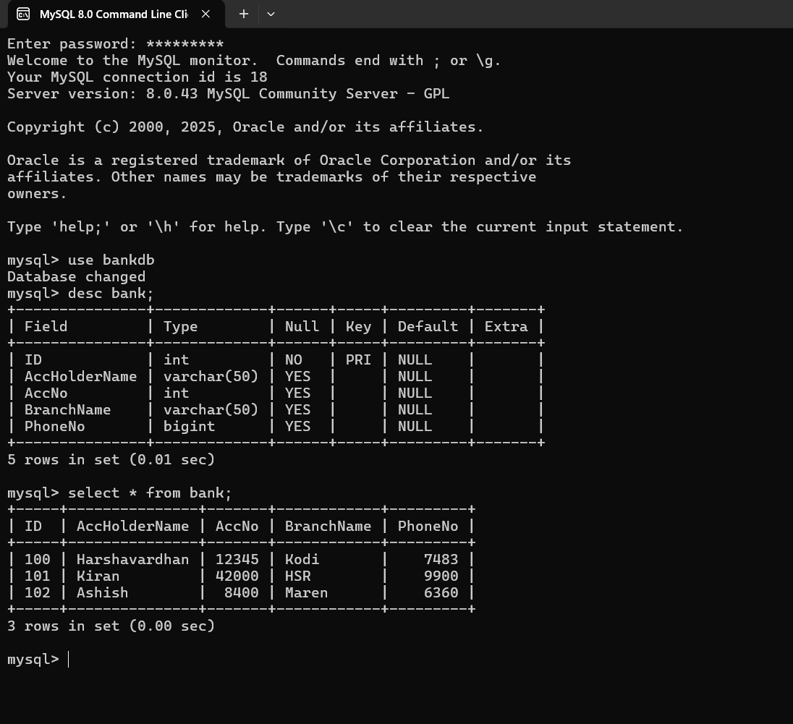

# 🏦 Bank Management System (JDBC + MySQL)

A simple Java + MySQL CRUD project to manage bank account details.  
Built using **Eclipse**, **JDK 21**, and **MySQL Connector/J**.

---

## 📘 Features
- ➕ Insert new records  
- 👀 Display all records  
- ✏️ Update existing data  
- ❌ Delete records  
- 🔐 Uses `.properties` file for DB credentials  

---

## ⚙️ Tech Stack
| Component | Technology |
|------------|-------------|
| Language | Java 21 |
| Database | MySQL |
| Connector | MySQL Connector/J |
| IDE | Eclipse IDE |

---

| Operation | Screenshot |
|------------|-------------|
| **Database Tables** |  |
| **Database Final Output** |  |
| **Insert Operation** |  |
| **Select Operation** |  |
| **Update Operation** |  |
| **Delete Operation** |  |
